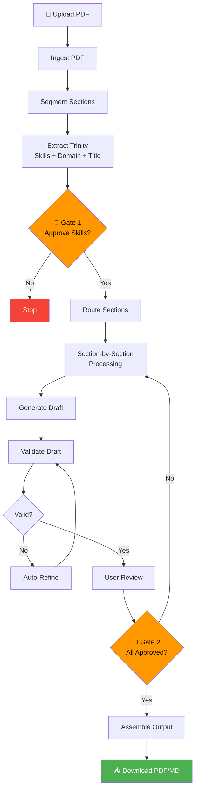

<p align="center">
  
  
  
  
  
</p>

# 🚀 JD Master

**AI-Powered Job Description Evolution Engine** — Transform job descriptions to match target seniority levels while preserving semantic accuracy and visual formatting.

> *Seniority-aware JD rewriting with human-in-the-loop validation, powered by LangGraph orchestration and Groq LLMs.*

---

## 🎯 Overview

JD Master is a production-grade system that intelligently transforms job descriptions to match specific seniority levels. It uses a **three-phase workflow** with human-in-the-loop (HITL) gates ensuring quality and accuracy:

1. **Phase 1: Ingest & Anchor** — Extract text from PDF, segment into semantic sections, and identify ground truth (skills, domain, job title)
2. **Phase 2: Reasoning & Drafting** — Apply seniority-specific transformations with actor-critic validation
3. **Phase 3: Assembly** — Reconstruct the document preserving original structure and visual formatting

### ✨ Key Features

- 🎭 **Seniority Transformation** — Entry-level, Mid-senior, and Principal/Leadership profiles with vocabulary shifts
- 🧠 **LangGraph Orchestration** — State machine workflow with ephemeral graphs per phase
- 🔍 **Semantic Segmentation** — Automatic classification of JD sections (Work Scope, Prerequisites, Skills, etc.)
- 🛡️ **Actor-Critic Validation** — Self-correcting loop to prevent hallucinations and profile violations
- 📄 **Visual Profile Preservation** — Extract and replicate original PDF styling (fonts, colors, spacing)
- 🎛️ **Section-by-Section Control** — Approve, regenerate, or keep original content for each section
- 📥 **Multi-Format Export** — Download as PDF (styled) or Markdown

---

## 🏗️ Architecture



### Directory Structure

```
JD_Master/
├── fastapi_main.py        # FastAPI backend with REST endpoints
├── main.py                # CLI/orchestrator entry point
├── index.html             # Vue.js single-page frontend
├── requirements.txt       # Python dependencies
├── .env                   # Environment variables (API keys)
│
├── config/
│   ├── settings.py        # Configuration management
│   └── seniority_profiles.json  # Seniority transformation rules
│
├── core/
│   ├── models.py          # Pydantic models (JDState, SectionBlock)
│   └── state_manager.py   # Immutable state management utilities
│
├── llm/
│   ├── groq_client.py     # Groq API wrapper with rate limiting
│   └── prompts.py         # Engineered prompt templates
│
├── processors/
│   ├── pdf_processor.py   # PDF extraction (pymupdf4llm)
│   ├── pdf_generator.py   # PDF generation (WeasyPrint)
│   ├── text_cleaner.py    # Markdown segmentation utilities
│   ├── visual_profile_extractor.py  # PDF visual analysis
│   └── dynamic_css_generator.py     # CSS from visual profile
│
├── workflow/
│   ├── graph_builder.py   # LangGraph workflow construction
│   ├── nodes.py           # Workflow node implementations
│   └── section_processor.py  # Granular section operations
│
└── utils/
    ├── logger.py          # Logging configuration
    └── validators.py      # Input validation utilities
```

---

## 🚀 Quick Start

### Prerequisites

- **Python 3.10+**
- **Groq API Key** (free tier available at [console.groq.com](https://console.groq.com))

### Installation

1. **Clone the repository**
   ```bash
   git clone https://github.com/TheAIGuy-org/JD_Master.git
   cd JD_Master
   ```

2. **Create virtual environment**
   ```bash
   python -m venv venv
   
   # Windows
   .\venv\Scripts\activate
   
   # Linux/Mac
   source venv/bin/activate
   ```

3. **Install dependencies**
   ```bash
   pip install -r requirements.txt
   ```

4. **Configure environment variables**
   
   Create a `.env` file in the project root:
   ```env
   GROQ_API_KEY=your_groq_api_key_here
   GROQ_REASONING_MODEL=llama-3.1-70b-versatile
   GROQ_SPEED_MODEL=llama-3.1-8b-instant
   GROQ_CALL_DELAY=2.0
   LOG_LEVEL=INFO
   ```

5. **Start the API server**
   ```bash
   python fastapi_main.py
   ```

6. **Open the UI**
   
   Open `index.html` in your browser, or serve it:
   ```bash
   # Optional: Serve with Python
   python -m http.server 3000
   ```
   Then navigate to `http://localhost:3000`

---

## 📖 Usage Guide

### Web Interface Workflow

1. **Setup** — Select target seniority level and upload a PDF job description
2. **Anchor** — Review and edit extracted skills and domain context
3. **Evolution** — Process each section:
   - Click **Generate Draft** to create AI-rewritten content
   - **Edit** the draft text directly if needed
   - Click **Approve & Next** or **Keep Original**
   - Use **Retry** for regeneration with custom instructions
4. **Finish** — Download the transformed JD as PDF or Markdown

### API Endpoints

| Method | Endpoint | Description |
|--------|----------|-------------|
| `GET` | `/profiles` | List available seniority profiles |
| `POST` | `/sessions` | Create processing session |
| `POST` | `/sessions/{id}/phase1` | Upload PDF and extract data |
| `POST` | `/sessions/{id}/gate1` | Approve skills and domain |
| `POST` | `/sessions/{id}/phase2/init` | Initialize section routing |
| `POST` | `/sessions/{id}/sections/{section_id}/generate` | Generate draft for section |
| `POST` | `/sessions/{id}/sections/{section_id}/approve` | Approve section content |
| `POST` | `/sessions/{id}/gate2` | Finalize all sections |
| `POST` | `/sessions/{id}/phase3` | Assemble final document |
| `GET` | `/sessions/{id}/download/pdf` | Download as PDF |
| `GET` | `/sessions/{id}/download/markdown` | Download as Markdown |

### Example API Usage

```python
import requests

API_BASE = "http://localhost:8000"

# 1. Create session
session = requests.post(
    f"{API_BASE}/sessions",
    json={"target_profile_key": "MID_LEVEL"}
).json()
session_id = session["session_id"]

# 2. Upload PDF (Phase 1)
with open("job_description.pdf", "rb") as f:
    result = requests.post(
        f"{API_BASE}/sessions/{session_id}/phase1",
        files={"file": f}
    ).json()

print(f"Extracted Skills: {result['extracted_skills']}")
print(f"Domain: {result['domain_context']}")

# 3. Approve Gate 1
requests.post(
    f"{API_BASE}/sessions/{session_id}/gate1",
    json={
        "approved_skills": result["extracted_skills"],
        "domain_context": result["domain_context"]
    }
)

# Continue with Phase 2, section processing, etc.
```

---

## ⚙️ Configuration

### Seniority Profiles

Located in `config/seniority_profiles.json`, each profile defines:

| Field | Description |
|-------|-------------|
| `label` | Display name (e.g., "Entry Level (0-2 Years)") |
| `reasoning_focus` | Behavioral guidance for the LLM |
| `autonomy_level` | Expected independence level |
| `risk_avoidance` | Content to avoid at this level |
| `vocabulary_shifts` | Word replacements (e.g., "lead" → "support") |
| `skill_filters` | Categories to exclude from extraction |

### Environment Variables

| Variable | Description | Default |
|----------|-------------|---------|
| `GROQ_API_KEY` | **Required.** Your Groq API key | — |
| `GROQ_REASONING_MODEL` | Model for complex reasoning | `llama-3.1-70b-versatile` |
| `GROQ_SPEED_MODEL` | Model for fast classification | `llama-3.1-8b-instant` |
| `GROQ_CALL_DELAY` | Seconds between API calls | `2.0` |
| `LOG_LEVEL` | Logging verbosity | `INFO` |

---

## 🧪 Technical Details

### Semantic Tags

Sections are automatically classified into:

- `WORK_SCOPE` — Responsibilities, duties, day-to-day activities
- `PREREQUISITES` — Required qualifications, education, experience
- `SKILL_LIST` — Technical skills, tools, technologies
- `BRAND_STATIC` — Company description, culture, values (passthrough)
- `COMPENSATION` — Salary, benefits, perks
- `UNKNOWN` — Unclassified sections

### Visual Profile Extraction

The system extracts styling metadata from input PDFs:
- Font families and sizes
- Color palettes
- Heading hierarchy
- Paragraph spacing
- Page layout (margins, orientation)

This profile is used during PDF generation to maintain visual consistency.

### State Management

The `JDState` TypedDict flows through the entire workflow:

```python
class JDState(TypedDict):
    raw_text: str               # Extracted PDF content
    target_profile: dict        # Active seniority profile
    sections: List[SectionBlock]  # Segmented content
    document_structure: dict    # Structural metadata
    approved_skills: List[str]  # Human-verified skills
    domain_context: str         # Business domain
    visual_profile: dict        # PDF styling data
    final_jd_markdown: str      # Assembled output
    # ... gates, phases, errors
```

---

## 🛠️ Development

### Running in Development Mode

```bash
uvicorn fastapi_main:app --reload --host 0.0.0.0 --port 8000
```

### Adding a New Seniority Profile

1. Edit `config/seniority_profiles.json`
2. Add a new key with the required fields
3. Restart the server

### Extending Semantic Tags

1. Add new tag to `SemanticTag` enum in `core/models.py`
2. Update heuristics in `workflow/nodes.py` → `_infer_semantic_tag()`
3. Adjust routing logic in `route_sections()` if needed

---

## 🤝 Contributing

Contributions are welcome! Please:

1. Fork the repository
2. Create a feature branch (`git checkout -b feature/amazing-feature`)
3. Commit your changes (`git commit -m 'Add amazing feature'`)
4. Push to the branch (`git push origin feature/amazing-feature`)
5. Open a Pull Request

### Code Style

- Follow PEP 8 guidelines
- Use type hints for all function signatures
- Include docstrings for public methods
- Keep functions focused and composable

---

## 🙏 Acknowledgments

- [LangGraph](https://github.com/langchain-ai/langgraph) — State machine orchestration
- [Groq](https://groq.com) — Ultra-fast LLM inference
- [pymupdf4llm](https://github.com/pymupdf/pymupdf4llm) — Structure-aware PDF extraction
- [WeasyPrint](https://weasyprint.org) — PDF generation from HTML/CSS
- [Vue.js](https://vuejs.org) — Reactive frontend framework

---

<p align="center">
  <strong>Built with ❤️ for HR teams and recruiters who value precision</strong>
</p>
